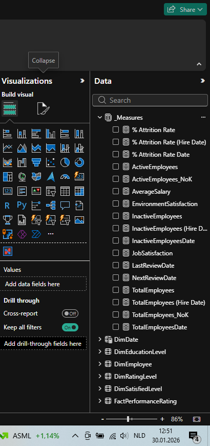

# HR Analytics Dashboard - Power BI

## Project Objective

In this project, I designed and built an end-to-end HR Analytics dashboard in Power BI to support data-driven decision-making within an HR department.

My objective was to convert raw HR data into clear, actionable insights by integrating demographic analysis, performance tracking, time-based trends, and employee attrition drivers into a single, well-structured analytical model.

---

## Data Modeling Approach

I designed the data model using a **star schema** to ensure clarity, scalability, and strong analytical performance.  
I deliberately separated fact and dimension tables to enable flexible slicing, accurate aggregations, and consistent filtering behavior.

### Key Tables in the Model

- **FactPerformanceRating**  
  I used this table to store employee performance reviews, satisfaction metrics, ratings, and review dates.

- **DimEmployee**  
  I designed this dimension to capture employee demographic and organizational attributes such as HireDate, Department, and JobRole.

- **DimDate**  
  I created a custom calendar table to support all time-based analyses across the report.

- **DimSatisfiedLevel / DimRatingLevel**  
  I used these tables to translate numeric scores into meaningful categorical levels for interpretation.

---

## DimDate (Calendar Table)

To ensure consistent and reliable time-based analysis, I created a custom **DimDate** table using DAX.

My goals were to:

- Analyze multiple date fields (HireDate, ReviewDate) on a single, unified time axis  
- Enable year, quarter, month, week, and fiscal-year breakdowns  
- Support accurate time-intelligence calculations and trend analysis  

I built the DimDate table dynamically based on the minimum and maximum employee hire dates, allowing the model to scale seamlessly as new data is added.

```DAX
DimDate =
VAR _minYear =
    YEAR ( MIN ( DimEmployee[HireDate] ) )
VAR _maxYear =
    YEAR ( MAX ( DimEmployee[HireDate] ) )
VAR _fiscalStart = 4
RETURN
    ADDCOLUMNS (
        CALENDAR ( DATE ( _minYear, 1, 1 ), DATE ( _maxYear, 12, 31 ) ),
        "Year", YEAR ( [Date] ),
        "Year Start", DATE ( YEAR ( [Date] ), 1, 1 ),
        "YearEnd", DATE ( YEAR ( [Date] ), 12, 31 ),
        "MonthNumber", MONTH ( [Date] ),
        "MonthStart", DATE ( YEAR ( [Date] ), MONTH ( [Date] ), 1 ),
        "MonthEnd", EOMONTH ( [Date], 0 ),
        "DaysInMonth",
            DATEDIFF (
                DATE ( YEAR ( [Date] ), MONTH ( [Date] ), 1 ),
                EOMONTH ( [Date], 0 ),
                DAY
            ) + 1,
        "YearMonthNumber", INT ( FORMAT ( [Date], "YYYYMM" ) ),
        "YearMonthName", FORMAT ( [Date], "YYYY-MMM" ),
        "DayNumber", DAY ( [Date] ),
        "DayName", FORMAT ( [Date], "DDDD" ),
        "DayNameShort", FORMAT ( [Date], "DDD" ),
        "DayOfWeek", WEEKDAY ( [Date] ),
        "MonthName", FORMAT ( [Date], "MMMM" ),
        "MonthNameShort", FORMAT ( [Date], "MMM" ),
        "Quarter", QUARTER ( [Date] ),
        "QuarterName", "Q" & FORMAT ( [Date], "Q" ),
        "YearQuarterNumber", INT ( FORMAT ( [Date], "YYYYQ" ) ),
        "YearQuarterName", FORMAT ( [Date], "YYYY" ) & " Q" & FORMAT ( [Date], "Q" ),
        "QuarterStart", DATE ( YEAR ( [Date] ), ( QUARTER ( [Date] ) * 3 ) - 2, 1 ),
        "QuarterEnd",
            EOMONTH (
                DATE ( YEAR ( [Date] ), QUARTER ( [Date] ) * 3, 1 ),
                0
            ),
        "WeekNumber", WEEKNUM ( [Date] ),
        "WeekStart", [Date] - WEEKDAY ( [Date] ) + 1,
        "WeekEnd", [Date] + 7 - WEEKDAY ( [Date] ),
        "FiscalYear",
            IF (
                _fiscalStart = 1,
                YEAR ( [Date] ),
                YEAR ( [Date] )
                    + QUOTIENT ( MONTH ( [Date] ) + ( 13 - _fiscalStart ), 13 )
            ),
        "FiscalQuarter",
            QUARTER (
                DATE (
                    YEAR ( [Date] ),
                    MOD ( MONTH ( [Date] ) + ( 13 - _fiscalStart ) - 1, 12 ) + 1,
                    1
                )
            ),
        "FiscalMonth",
            MOD ( MONTH ( [Date] ) + ( 13 - _fiscalStart ) - 1, 12 ) + 1
    )
```

---

## _Measures Table (Calculation Layer)

I centralized all DAX calculations in a dedicated **_Measures** table to create a clear calculation layer.

This approach allowed me to:

- Improve overall model readability  
- Maintain a clean separation between data structure and business logic  
- Reuse measures consistently across multiple report pages and visuals
- 


---

## DAX Usage

DAX played a central role throughout this project.  
I deliberately applied advanced DAX functions to control filter context, activate relationships, and ensure accurate calculations:

- **CALCULATE()** – to modify filter context dynamically  
- **USERELATIONSHIP()** – to activate inactive date relationships when required  
- **DIVIDE()** – to calculate rates safely and avoid division errors  
- **SELECTEDVALUE()** – to enable single-employee drill-down analysis  
- **FORMAT()** – to improve the readability of dates and percentage values

  ---
This DAX-driven approach allowed me to perform flexible analysis from a single data model while preserving both accuracy and performance.

---

## Report Pages and Analytical Goals

### Overview

I designed the Overview page to provide executive-level insight at a glance.

On this page, I summarized:

- Total, active, and inactive employee counts  
- Overall attrition rate  
- Hiring and attrition trends over time  
- Employee distribution by department and job role  

My goal was to present a high-level workforce snapshot in a single, intuitive view.

---

### Demographics

I built the Demographics page to analyze workforce composition and diversity.

This page includes:

- Age distribution analysis  
- Age and gender breakdowns  
- Marital status composition  
- Ethnicity combined with average salary analysis  

The purpose of this page was to support Diversity & Inclusion (D&I) insights and long-term workforce planning.

---

### Performance Tracker

I designed the Performance Tracker page to monitor individual employee performance over time.

Key features include:

- An employee selection slicer  
- Hire date, last review date, and next review date indicators  
- Time-based trends for job satisfaction, environment satisfaction, and work-life balance  
- A comparison between self-ratings and manager ratings  

My objective was to identify alignment or gaps between employee self-perception and managerial evaluation.

---

### Attrition

I built the Attrition page to analyze why employees leave and under which conditions.

On this page, I analyzed attrition by:

- Department and job role  
- Business travel frequency  
- Overtime requirements  
- Years at the company  
- Hire-date-based time trends  

The goal of this analysis was to generate actionable insights that can inform effective employee retention strategies.
